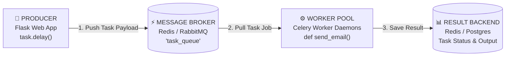

# Day 21 - Module 0: Background Processing & Celery Fundamentals for Beginners

Welcome to **Day 21** and **Phase 5: Asynchronous Architecture, Caching & Real-Time Web**!

In Phase 1 to Phase 4 (Days 01 to 20), our Flask web server handled every request **synchronously** in the HTTP request thread. However, when users perform long-running tasks—like sending automated emails via `smtplib`, generating complex PDF reports, resizing large images, or calling slow third-party payment APIs—executing those operations inside the request thread will **freeze your web server**!

Today, we learn how to offload heavy workloads to background workers using **Celery** and **Redis**!

---

## 1. The Synchronous Blocking Problem in Web Applications

When a client makes an HTTP request to a traditional WSGI server (like Gunicorn with 4 workers), each worker thread handles **one request at a time**.

### 💥 The Bottleneck:
If a user registers and your code sends a welcome email synchronously:

```python
# ❌ SYNCHRONOUS BLOCKING ANTI-PATTERN (Freezes the web server for 4 seconds!)
@app.route('/register', methods=['POST'])
def register():
    create_user(request.form)
    
    # smtplib connects to Gmail SMTP server over TCP network (takes 3.5 seconds)
    send_welcome_email(request.form['email'])  # Worker thread is FROZEN!
    
    return "Registration successful!"
```

If 4 users register at the same second, **all 4 Gunicorn workers are blocked**. A 5th user trying to view the homepage (`GET /`) will experience a connection timeout or gateway error (`504 Gateway Timeout`)!

```
SYNCHRONOUS FLOW (Slow & Blocking):
User ──[ POST /register ]──> Flask Worker ──[ Wait 4s for SMTP Email ]──> User (Waits 4s!)
                             (Worker blocked! Cannot handle other requests!)

ASYNCHRONOUS FLOW with CELERY (Instant & Scalable):
User ──[ POST /register ]──> Flask Worker ──[ Push task to Redis Queue ]──> User (Responds in 20ms!)
                                                   │
                                                   ▼
                                            Celery Worker (Sends email in background!)
```

---

## 2. The 4 Core Pillars of Celery Architecture

**Celery** is an open-source, distributed asynchronous task queue that executes background jobs outside the web request cycle.



| Pillar | Component in Our Stack | Plain-English Role |
| :--- | :--- | :--- |
| **1. Producer** | Flask Application | Creates task requests and pushes them to the queue using `.delay(args)`. |
| **2. Message Broker** | Redis (`redis://localhost:6379/0`) | The high-speed message buffer holding pending tasks in memory until a worker is ready. |
| **3. Worker Pool** | Celery Worker Daemon | Dedicated background Python processes that consume and execute task functions. |
| **4. Result Backend** | Redis (`redis://localhost:6379/1`) | Stores task return values, execution states (`PENDING`, `STARTED`, `SUCCESS`, `FAILURE`), and error tracebacks. |

---

## 3. Asynchronous Task Dispatch: `.delay()` vs `.apply_async()`

When you define a task function in Celery using `@celery.task`, Celery gives that function special asynchronous methods:

### 1. `.delay(*args, **kwargs)`
The shortcut method for asynchronous task dispatch:
```python
# Dispatches task to Redis queue and returns an AsyncResult immediately!
task = send_welcome_email.delay("alice@company.com")
print(f"Task dispatched with Task ID: {task.id}")
```

### 2. `.apply_async(args, countdown, retry, eta)`
The advanced method supporting scheduling, countdown delays, and custom queues:
```python
# Executes the task in the background after a 60-second countdown delay:
send_welcome_email.apply_async(args=["alice@company.com"], countdown=60)
```

---

## 4. Introduction to Celery Canvas (Workflow Primitives)

In real-world enterprise applications, background jobs often involve complex multi-step workflows. Celery provides **Canvas primitives** to orchestrate tasks:

### 1. `chain` (Sequential Execution)
Execute tasks sequentially, passing the output of task #1 into task #2:
```python
from celery import chain

# Download file -> Compress Image -> Upload to S3
workflow = chain(download_file.s(url) | compress_image.s() | upload_to_s3.s())
workflow.delay()
```

### 2. `group` (Parallel Execution)
Execute multiple independent tasks in parallel:
```python
from celery import group

# Process 100 customer statements simultaneously across worker pool
job = group(generate_statement.s(user_id) for user_id in active_user_ids)
job.delay()
```

### 3. `chord` (Parallel Execution with Callback Aggregation)
Execute a group of tasks in parallel, and run a final callback once all tasks complete:
```python
from celery import chord

# Generate 10 report sections in parallel, then merge into single PDF
chord(
    [generate_section.s(i) for i in range(1, 11)]
)(merge_sections_and_email.s(recipient="manager@company.com"))
```

---

## 💡 Summary Checklist

- [x] Why do web apps need background task queues? (Prevent heavy operations from blocking the web server request threads)
- [x] What are the 4 pillars of Celery? (Producer, Message Broker, Worker, Result Backend)
- [x] What is the difference between `.delay()` and direct execution? (`task()` runs synchronously; `task.delay()` offloads execution to background workers)
- [x] What are Celery Canvas workflows? (`chain` for sequential pipelines, `group` for parallel jobs, `chord` for parallel jobs with a final callback)

Next up: **[Module 1: Celery Worker Setup & Redis Integration](file:///c:/Users/SHABBER%20HUSSAIN/Desktop/FLASK/DAY%2021%20-%20Background%20Processing%20with%20Celery%20and%20Redis/1.%20Celery%20Architecture%20and%20Redis%20Integration.md)**!
